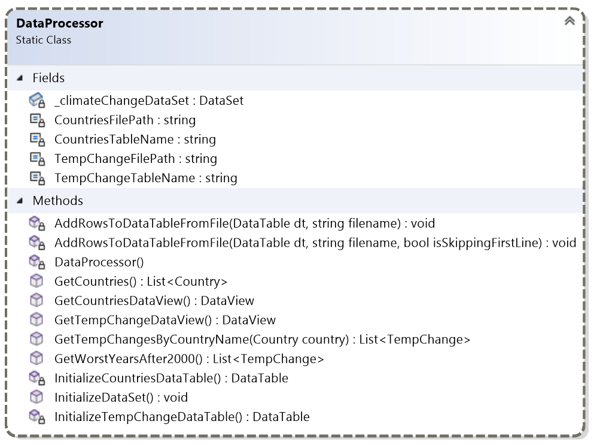

# ADO.NET-disconnected-2---ClimateChange

*De wereld is om zeep.*  
*Er gebeuren rare dingen rondom mij.*  
*Helemaal om zeep*  
*en het laatste oordeel kan niet ver meer zijn…*  
--Urbanus

*Vrienden 't is tijd om uw pakske te maken.*  
*Roept al uw pottekes en pannekes bijeen.*  
*Tracht als ge kunt nog wat vreugde te smaken,*  
*vreugd en verdriet springen 't langst op de been.*  
*Want de aarde die is al aan 't verdoven.*  
*'t Schijnt dat de zon en de maan ons verlaat.*  
*Niemand verplicht ik toch mij te geloven,*  
*maar 't is de roep dat de wereld vergaat.*  
--Laïs

Om een beter inzicht te krijgen in de stijgende temperaturen van de wereld werd aan jou gevraagd om een applicatie te maken die dit beter in beeld brengt. Maak een overzicht van de opwarming per land en toon de ergste jaren per land per jaar aan.

Er zijn twee datasets voorzien, één met informatie van de landen en één met de jaarlijkse temperatuurs aanpassing.

## 1.1 Data Model

## 1.2 Applicatie Layout

#### MainWindow:
*(Overzicht van landen en temperatuur tabbladen)*

#### Detail Tab:

#### Slechtste jaren post 2000 Tab:

#### Export:

## 1.3 Applicatie functionaliteit

### 1.3.1 Class Library

#### Country & TempChange

1. Voorzie twee model klasses voor Country en TempChange. Zowel Country als TempChange hebben een constructor voor elke property.
2. Overschrijf het standaard gedrag van de ToString() methode, zodat een object van Country de CountryName teruggeeft.

3. Let op: TempChange heeft een nullable double voor Change, aangezien de waarde niet altijd gemeten is voor elk jaar van elk land.

*"The FAOSTAT Temperature change on land domain disseminates statistics of mean surface temperature change by country, with annual updates. The current dissemination covers the period 1961–2023. Statistics are available for monthly, seasonal and annual mean temperature anomalies, i.e., temperature change with respect to a baseline climatology, corresponding to the period 1951–1980. The standard deviation of the temperature change of the baseline methodology is also available. Data are based on the publicly available GISTEMP data, the Global Surface Temperature Change data distributed by the National Aeronautics and Space Administration Goddard Institute for Space Studies (NASA-GISS)."* 
--*https://www.fao.org/faostat/en/#data/ET/metadata*

Zie onderaan voor verduidelijking voor Chang waarde in TempChange.

#### Data Processor

1. Voorzie een methode `InitializeDataSet()` die de DataTables van Countries en TempChange toevoegd aan de DataSet. Maak gebruik van de volgende twee methodes: InitializeCountriesDataTable() en InitializeTempChangeDataTable().
	1. Voorzie een methode `InitializeCountriesDataTable()` die de csv file uitleest van landen en in een DataTable zet.
	2. Voorzie een methode `InitializeTempChangeDataTable()` die de csv file uitleest van temperaturen en in een DataTable zet.
2. Voorzie een methode `GetCountriesDataView()` die het DataView teruggeeft van alle Countries in de DataTable.
3. Voorzie een methode `GetTempChangeDataView()` die het DataView teruggeeft van alle TempChanges in de DataTable.
4. Voorzie een methode `GetWorstYearsAfter2000()` die een List van TempChange objecten teruggeeft. In de lijst zitten enkel TempChanges na het jaar 2000 en die warmer zijn dan +1.2 °C in een aflopende volgorde (warm naar koud).
5. Voorzie een methode `GetCountries()` die een lijst geeft van alle landen. Deze methode gebruik je in MainWindow om alle ComboBoxItems in te laden.
6. Voorzie een methode `GetTempChangesByCountryName(Country country)` die een List teruggeeft van TempChanges van het gegeven land in stijgende volgorde op basis van het jaar.
7. Uitdaging: Probeer een methode te schrijven `AddRowsToDataTableFromFile(DataTable dt, string filename)` die je voor beide DataTables kan gebruiken om alle DataRows toe te voegen aan een gegeven DataTable.

### 1.3.2 MainWindow

1. Als gebruiker kan ik een overzicht zien van alle landen in het tabpanel “Overzicht Landen”.
2. Als gebruiker kan ik een overzicht zien van alle temperatuursveranderingenin het tabpanel “Overzicht Temperatuur”.
3. Als gebruiker kan ik een land selecteren in de ComboBox in het tabpanel “Detail” om een land te kiezen.
4. Als gebruiker kan ik een overzicht zien van alle slechtste jaren na 2000 van elk land in het tabpanel “Slechtste jaren na 2000”.
5. Voorzien een methode LoadComboBoxItems() die alle ComboBoxItems in laad van alle mogelijke landen.
6. Gebruik een CountriesComboBox_SelectionChanged() om er voor te zorgen dat de informatie van elk land ingeladen wordt, wanneer er een land wordt geselecteerd in de ComboBox.
7. Gebruik een methode LoadListBoxItemsByCountry(Country country) die de ListBoxItems toevoegd aan een ListBox op basis van een land. Elk ListBoxItem krijgt een achtergrondkleur toegewezen. Gebruik hiervoor de Brushes klasse.
	1. Temp < 0.5 : GreenYellow
	2. Temp < 1 : Yellow
	3. Temp < 1.5 : Orange
	4. Temp < 2 : OrangeRed
	5. Temp < 2.5 : Red
	6. Temp < 3 : Purple
8. Als gebruiker kan ik via het Export tabblad mijn ClimateChangeDataSet exporteren naar XML door op de Export-knop te klikken.

## 1.4 TempChange uitgelegd
De tempchange waarde stelt de gemiddelde jaarlijkse temperatuurafwijking voor van een land in een specifiek jaar, vergeleken met een baseline-klimaatperiode van 1951–1980. Met andere woorden:
	
	TempChange = Gemeten_gemiddelde_temperatuur_in_jaar_X – Gemiddelde_temperatuur_van_1951–1980

Wat zegt deze waarde?
Een positieve waarde (bijvoorbeeld +1.5 °C) betekent dat het betreffende land in dat jaar gemiddeld 1.5 °C warmer was dan het gemiddelde in de baseline-periode.

Een negatieve waarde (bijvoorbeeld -0.3 °C) betekent dat het land dat jaar gemiddeld 0.3 °C kouder was dan het baseline-gemiddelde.

Waarom is dit belangrijk?
Deze waarde geeft inzicht in hoe sterk een land opwarmt of afkoelt ten opzichte van het klimaat uit het midden van de 20e eeuw. Het is een veelgebruikte manier in klimaatwetenschap om de impact van klimaatverandering zichtbaar te maken.

*De data in deze opdracht is gebaseerd op NASA-GISS GISTEMP metingen en toont per land en per jaar hoeveel graden de temperatuur afwijkt van het gemiddelde in de periode 1951–1980.*